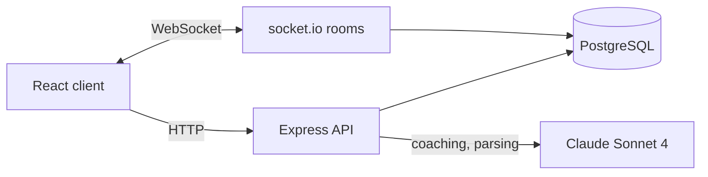

# ASCEND

A training app that estimates per-muscle recovery from recent workouts, logs sessions from plain-English descriptions, and provides an AI coach grounded in the user's own training data.


## Overview

Generic workout apps record what you did but say little about what you should do next. ASCEND scores how recovered each muscle group is, so the next session can target what is ready, and pairs that with a coach that sees the user's actual history rather than giving generic advice.

It also supports live group challenges, with leaderboards that update as participants log workouts.

## Highlights

- **Recovery scoring.** A deterministic 0 to 100 readiness score for seven muscle groups, computed from the past seven days of training volume and elapsed time.
- **Grounded AI coaching.** Each chat request includes the user's 20 most recent workouts and current recovery scores, and the response streams over Server-Sent Events.
- **Validated natural-language logging.** Free-text descriptions become structured workout records; model output that does not parse is rejected rather than stored.
- **Real-time challenges.** Leaderboard updates are pushed over socket.io only to the rooms of challenges the participant has joined.

## How it works

1. A user logs a workout through a form or by describing it, for example "4 sets of 8 bench at 80 kg".
2. Descriptions are sent to Claude with a strict output specification and converted into exercise, sets, reps, weight and muscle group.
3. The recovery endpoint recomputes readiness for each muscle group from the last seven days of workouts.
4. The coach combines recent workouts and recovery into the prompt and streams its answer.
5. If the user is in any challenges, standings are recalculated and pushed to the relevant rooms.

## Architecture



A single Express 5 server hosts the REST API and the socket.io server, backed by one PostgreSQL connection pool. The React client is built with Vite and served by nginx in production, which also proxies API and WebSocket traffic to the server. Authentication uses bcrypt password hashes and JWTs checked by middleware on every protected route.

## Engineering decisions

**A simple, explainable recovery model.** Each muscle starts at 100. Every workout in the last week subtracts `min(sets × reps × weight / 100, 60)` and 15 points are restored per elapsed day, clamped to 0 to 100. A learned model would need data the app does not yet have; a transparent formula is easy to reason about and tune, at the cost of ignoring individual recovery rates.

**Grounding over prompting.** Rather than asking the model general fitness questions, the server assembles the user's own data into each request. This makes answers specific without fine-tuning, with the trade-off of larger prompts that scale with history, which is why context is capped at 20 workouts.

**Rejecting unparseable model output.** Natural-language logging instructs the model to return a fixed JSON shape with an enumerated muscle group. Output that fails to parse returns HTTP 422 instead of writing a partial record, so malformed responses never corrupt training history.

**Search that degrades gracefully.** Workout search runs PostgreSQL full-text search ranked by `ts_rank` first, and falls back to case-insensitive substring matching when full-text returns nothing or errors. Users always get results, even for partial words that stemming misses.

**Scoped real-time updates.** Instead of broadcasting every change, a logged workout triggers recalculation only for the challenges that participant has joined, and emits only to those rooms.

## Tech stack

**Frontend:** React 18, Vite  
**Backend:** Node.js 20, Express 5, socket.io 4  
**Database:** PostgreSQL 16 with pgvector  
**AI:** Anthropic Claude Sonnet 4  
**Infrastructure:** Docker, docker-compose, nginx

## Testing

There is no automated test suite yet. The recovery model and the output parser are pure functions and are the first candidates for unit tests.

## Getting started

Requires Node.js 20+, PostgreSQL 16 with pgvector, and an Anthropic API key. Set `DATABASE_URL`, `JWT_SECRET` and `ANTHROPIC_API_KEY` in `.env` (see `.env.example`).

```bash
docker-compose up --build    # database, API on :3000, client on :80
```

Without Docker: `npm install`, `node setup.js` to create the schema (safe to re-run), `node server.js`, then `npm run dev` in `frontend/`.

## API

| Method | Path | Description |
|---|---|---|
| POST | `/api/auth/signup`, `/api/auth/login` | Create an account; authenticate and receive a JWT |
| GET, POST, PUT, DELETE | `/api/workouts` | Workout CRUD |
| GET | `/api/workouts/search?q=` | Substring search |
| POST | `/api/workouts/semantic-search` | Ranked full-text search |
| POST | `/api/workouts/voice` | Parse a description and log it |
| GET | `/api/recovery` | Per-muscle recovery scores |
| POST | `/api/chat` | Streaming coaching response (SSE) |
| GET, POST | `/api/challenges`, `/api/challenges/:id/join` | List, create and join challenges |
| GET | `/api/leaderboard/:id` | Challenge leaderboard |

All routes except signup and login require a bearer token. WebSocket clients send `join_challenge` and `leave_challenge` and receive `leaderboard_update`.

## Future work

- Embedding-based semantic search using the pgvector column and IVFFlat index already provisioned in the schema.
- Token expiry and refresh; JWTs are currently issued without an expiry.
- Unit tests for the recovery model and parser, and integration tests for the API.
- Progressive-overload detection and plateau alerts.

## License

MIT. See [LICENSE](./LICENSE).
