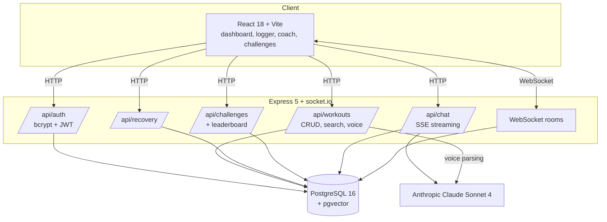

# ASCEND

AI fitness coaching with per-muscle recovery scoring, natural-language workout logging and live challenges.


## Overview

ASCEND is a full-stack training application. It estimates how recovered each muscle group is from recent training volume and time elapsed, lets users log sessions in plain English, and provides an AI coach that answers with the user's training history and recovery state as context. Users can also join challenges whose leaderboards update in real time over WebSockets.

## Contents

- [Features](#features)
- [Architecture](#architecture)
- [Implementation notes](#implementation-notes)
- [Getting started](#getting-started)
- [API reference](#api-reference)
- [Project structure](#project-structure)
- [Roadmap](#roadmap)
- [License](#license)

## Features

- **Recovery scoring.** A 0 to 100 readiness score for seven muscle groups, computed from the previous seven days of training.
- **AI coach.** Streaming chat (Server-Sent Events) backed by Claude Sonnet 4, grounded in the user's recent workouts and current recovery scores.
- **Natural-language logging.** A free-text description of a session is converted by the model into a structured workout record.
- **Workout search.** PostgreSQL full-text search ranked with `ts_rank`, with an `ILIKE` fallback for partial matches.
- **Live challenges.** Challenge rooms with leaderboards pushed to participants through socket.io.
- **Authentication.** Password hashing with bcrypt and JWT-protected API routes.
- **Containerised deployment.** Docker images for the API and an nginx-served frontend, orchestrated with docker-compose.

## Architecture



| Layer | Technology |
|---|---|
| Client | React 18, Vite 6, CSS custom properties |
| Server | Node.js 20, Express 5, socket.io 4 |
| Database | PostgreSQL 16 with the pgvector extension |
| AI | Anthropic Claude Sonnet 4 (coaching and structured parsing) |
| Auth | bcrypt, JSON Web Tokens |
| Deployment | Docker, docker-compose, nginx |

## Implementation notes

**Recovery model.** Each muscle group starts at 100. For every workout in the last seven days, fatigue equal to `min(sets × reps × weight / 100, 60)` is subtracted and 15 points per elapsed day are restored, with the result clamped to 0 to 100. The model is deliberately simple and deterministic, so its output is explainable and easy to tune.

**Grounded coaching.** Each chat request loads the user's 20 most recent workouts and computes current recovery before calling the model, so advice reflects actual training rather than generic guidance. Responses stream to the client over SSE.

**Structured parsing with validation.** Natural-language logging instructs the model to return a JSON object with a fixed set of fields and an enumerated muscle group. Output that fails to parse is rejected with HTTP 422 rather than written to the database.

**Search with graceful degradation.** Ranked full-text search runs first; if it returns nothing or errors, the query falls back to case-insensitive substring matching so users still get results.

**Real-time leaderboards.** When a participant logs a workout, the server recalculates standings for each challenge the participant has joined and emits `leaderboard_update` to those socket.io rooms only.

**Idempotent schema bootstrap.** `setup.js` creates tables and constraints with `IF NOT EXISTS` guards and can be re-run safely. A 1,536-dimension `vector` column and an IVFFlat index are provisioned for planned embedding-based search.

## Getting started

### Prerequisites

- Node.js 20 or later
- PostgreSQL 16 or later with the pgvector extension
- An [Anthropic API key](https://console.anthropic.com/)
- Docker (optional)

### Configuration

```bash
cp .env.example .env
```

| Variable | Description |
|---|---|
| `DATABASE_URL` | PostgreSQL connection string |
| `JWT_SECRET` | Secret used to sign JWTs |
| `ANTHROPIC_API_KEY` | Anthropic API key |

### Local setup

```bash
git clone https://github.com/aryansajiv19/ASCEND
cd ASCEND
npm install
(cd frontend && npm install)
node setup.js                 # create the schema (safe to re-run)
node server.js                # API on http://localhost:3000
(cd frontend && npm run dev)  # client on http://localhost:5000, run in a second terminal
```

The Vite dev server proxies `/api` and `/socket.io` to the API.

### Docker

```bash
docker-compose up --build
```

| Service | Image | Port |
|---|---|---|
| `db` | `pgvector/pgvector:pg16` | 5432 |
| `app` | Node.js 20 Alpine | 3000 |
| `frontend` | nginx (multi-stage Vite build) | 80 |

## API reference

All routes except signup and login require a bearer token.

| Method | Path | Description |
|---|---|---|
| POST | `/api/auth/signup` | Create an account |
| POST | `/api/auth/login` | Authenticate and receive a JWT |
| GET | `/api/workouts` | List the user's workouts |
| POST | `/api/workouts` | Log a workout |
| PUT | `/api/workouts/:id` | Update a workout |
| DELETE | `/api/workouts/:id` | Delete a workout |
| GET | `/api/workouts/search?q=` | Substring search |
| POST | `/api/workouts/semantic-search` | Ranked full-text search |
| POST | `/api/workouts/voice` | Parse a natural-language description and log it |
| GET | `/api/recovery` | Per-muscle recovery scores (0 to 100) |
| POST | `/api/chat` | Streaming coaching response (SSE); body `{ message, stream: true }` |
| GET | `/api/challenges` | List challenges |
| POST | `/api/challenges` | Create a challenge |
| POST | `/api/challenges/:id/join` | Join a challenge |
| GET | `/api/leaderboard/:id` | Challenge leaderboard |

| WebSocket event | Direction | Description |
|---|---|---|
| `join_challenge` | Client to server | Subscribe to a challenge room |
| `leave_challenge` | Client to server | Unsubscribe from a challenge room |
| `leaderboard_update` | Server to client | Updated standings after a participant logs a workout |

## Project structure

```
ASCEND/
├── server.js            Express and socket.io entry point
├── auth.js              Signup and login
├── middleware.js        JWT verification
├── chat.js              Streaming coaching endpoint
├── voice.js             Natural-language workout parsing
├── embeddings.js        Ranked full-text search
├── recovery.js          Recovery scoring
├── challenges.js        Challenge endpoints
├── leaderboard.js       Leaderboard endpoints
├── db.js                PostgreSQL connection pool
├── setup.js             Idempotent schema bootstrap
├── Dockerfile           API image
├── docker-compose.yml   Full-stack orchestration
└── frontend/
    ├── Dockerfile       Multi-stage build served by nginx
    ├── nginx.conf       SPA fallback and API reverse proxy
    └── src/             Pages, components, API client and styles
```

## Roadmap

- Embedding-based semantic search using the provisioned pgvector column
- Token expiry and refresh for JWTs
- Progressive-overload detection and plateau alerts
- Training plan generation from recovery and history
- Structured logging and request tracing
- Automated test suite

## License

Released under the MIT License. See [LICENSE](./LICENSE).
